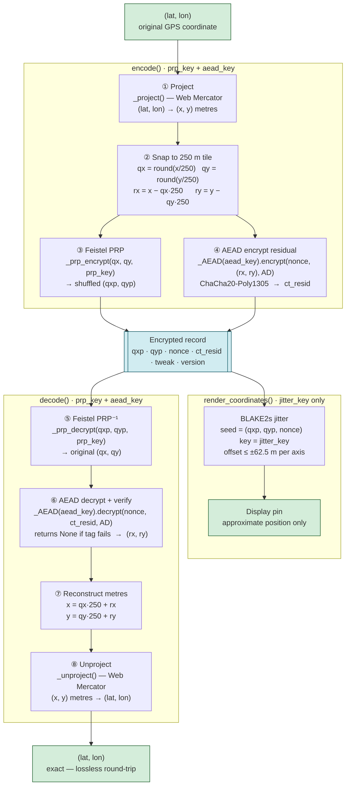

# Map Encryption Library

A Python library for reversible encryption of geographic coordinates that
hides both tile identity (via a Feistel PRP) and sub-tile precision (via
ChaCha20-Poly1305 AEAD), while enabling a display tier to render jittered
map pins without ever decrypting precise GPS coordinates.

All spatial examples use the **1854 Soho cholera outbreak dataset** (John Snow):
250 death locations and 8 water pump locations from `data/cholera_deaths.csv`
and `data/pumps.csv`.

## How It Works

- **Project** — Convert (lat, lon) to Web Mercator metres (NB02)
- **Snap + Shuffle** — Quantise to a 250 m tile; permute tile indices with a
  Feistel pseudorandom permutation keyed by `prp_key` (NB03)
- **Lock** — AEAD-encrypt the sub-tile residual (rx, ry) with ChaCha20-Poly1305,
  binding the ciphertext to (qx, qy, tweak) via associated data (NB04)
- **Wobble** — Add per-record jitter using only `jitter_key` for display;
  no precise coordinates are exposed to the display tier (NB05)



## Quick Start

```bash
conda env create -f environment.yml
conda activate crypto
jupyter lab 01-introduction.ipynb
```

[](https://mybinder.org/v2/gh/PHI-Case-Studies/2026-Map-Encryption-Library/HEAD)

> **Binder note:** Open and run **one notebook at a time**. Keeping multiple
> notebooks active simultaneously will exhaust Binder's memory limit and crash
> the session. Shut down a notebook's kernel before opening the next one.

## Files

| File | Description |
|------|-------------|
| `map_encryption.py` | Core library: all crypto logic, public API and private helpers |
| `01-introduction.ipynb` | Problem statement, pipeline overview, 250 cholera death locations |
| `02-coordinate-projection.ipynb` | Web Mercator derivation, scale distortion, 8-pump round-trip |
| `03-grid-snapping-and-prp.ipynb` | Grid quantisation, Feistel PRP walkthrough, rejection sampling |
| `04-residual-encryption-aead.ipynb` | ChaCha20-Poly1305, AD construction, tamper-detection demo |
| `05-key-derivation-and-display-jitter.ipynb` | HKDF-style KDF, jitter mechanics, key privilege separation |
| `06-complete-pipeline.ipynb` | Public-API end-to-end with 250 cholera records and failure modes |
| `07-security-and-limitations.ipynb` | Threat model, 5 limitations, improvement directions |
| `08-evaluation.ipynb` | EDD, MNND, DBSCAN cluster fidelity metrics (Lin 2023) on cholera data |
| `09-ct-resid-externalization.ipynb` | Split storage architecture, AEAD-PRP mutual dependency |
| `10-geoprivacy-ethics.ipynb` | Six ethical tensions, three public health scenarios, principle mapping |
| `data/cholera_deaths.csv` | 250 death locations from the 1854 Soho outbreak (John Snow) |
| `data/pumps.csv` | 8 water pump locations used in Snow's investigation |
| `NOTEBOOKS.md` | Narrative guide, reading paths, per-notebook descriptions |
| `environment.yml` | Conda environment specification |
| `archive/` | Original prototype notebook (`map-encryption-v3-validated.ipynb`) |

## Dependencies

- **Python 3.10**
- **numpy** — numerical arrays
- **matplotlib** — NB01 only (side-by-side scatter)
- **plotly** — interactive charts in NB02–NB10
- **folium** — interactive maps in NB02, NB03, NB05, NB06, NB08
- **pandas** — CSV loading and DataFrame construction
- **scipy** — nearest-neighbour distance (MNND) in NB08
- **scikit-learn** — DBSCAN cluster evaluation in NB08 and NB10
- **cryptography** (preferred) — ChaCha20-Poly1305 AEAD via
  `cryptography.hazmat.primitives.ciphers.aead`

**Fallback:** If `cryptography` is not installed, the library falls back to
XOR + HMAC-SHA256 using only the Python standard library. All security
properties are preserved; ChaCha20-Poly1305 is preferred for performance
and standards compliance.

> **Note:** BLAKE2s is used throughout (key derivation, PRF, jitter) via
> `hashlib.blake2s` in the Python standard library — no external dependency
> is required for the non-AEAD cryptographic operations.

Each notebook ends with a References section citing the sources relevant to that topic.
