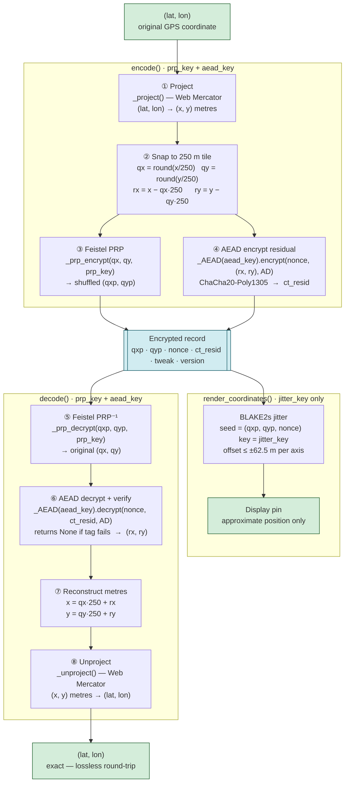

# Map Encryption Library

A Python library for reversible encryption of geographic coordinates that
hides both tile identity (via a Feistel PRP) and sub-tile precision (via
ChaCha20-Poly1305 AEAD), while enabling a display tier to render jittered
map pins without ever decrypting precise GPS coordinates.

All spatial examples use the **1854 Soho cholera outbreak dataset** (John Snow):
250 death locations and 8 water pump locations from `data/cholera_deaths.csv`
and `data/pumps.csv`.

## How It Works

- **Project** — Convert (lat, lon) to Web Mercator metres (NB02)
- **Snap + Shuffle** — Quantise to a 250 m tile; permute tile indices with a
  Feistel pseudorandom permutation keyed by `prp_key` (NB03)
- **Lock** — AEAD-encrypt the sub-tile residual (rx, ry) with ChaCha20-Poly1305,
  binding the ciphertext to (qx, qy, tweak) via associated data (NB04)
- **Wobble** — Add per-record jitter using only `jitter_key` for display;
  no precise coordinates are exposed to the display tier (NB05)



## Quick Start

```bash
conda env create -f environment.yml
conda activate crypto
jupyter lab 01-introduction.ipynb
```

[](https://mybinder.org/v2/gh/PHI-Case-Studies/2026-Map-Encryption-Library/HEAD)

> **Binder note:** Open and run **one notebook at a time**. Keeping multiple
> notebooks active simultaneously will exhaust Binder's memory limit and crash
> the session. Shut down a notebook's kernel before opening the next one.

## Files

| File | Description |
|------|-------------|
| `map_encryption.py` | Core library: all crypto logic, public API and private helpers |
| `01-introduction.ipynb` | Problem statement, pipeline overview, 250 cholera death locations |
| `02-coordinate-projection.ipynb` | Web Mercator derivation, scale distortion, 8-pump round-trip |
| `03-grid-snapping-and-prp.ipynb` | Grid quantisation, Feistel PRP walkthrough, rejection sampling |
| `04-residual-encryption-aead.ipynb` | ChaCha20-Poly1305, AD construction, tamper-detection demo |
| `05-key-derivation-and-display-jitter.ipynb` | HKDF-style KDF, jitter mechanics, key privilege separation |
| `06-complete-pipeline.ipynb` | Public-API end-to-end with 250 cholera records and failure modes |
| `07-security-and-limitations.ipynb` | Threat model, 5 limitations, improvement directions |
| `08-evaluation.ipynb` | EDD, MNND, DBSCAN cluster fidelity metrics (Lin 2023) on cholera data |
| `09-ct-resid-externalization.ipynb` | Split storage architecture, AEAD-PRP mutual dependency |
| `10-geoprivacy-ethics.ipynb` | Six ethical tensions, three public health scenarios, principle mapping |
| `data/cholera_deaths.csv` | 250 death locations from the 1854 Soho outbreak (John Snow) |
| `data/pumps.csv` | 8 water pump locations used in Snow's investigation |
| `NOTEBOOKS.md` | Narrative guide, reading paths, per-notebook descriptions |
| `environment.yml` | Conda environment specification |
| `archive/` | Original prototype notebook (`map-encryption-v3-validated.ipynb`) |

## Dependencies

- **Python 3.10**
- **numpy** — numerical arrays
- **matplotlib** — NB01 only (side-by-side scatter)
- **plotly** — interactive charts in NB02–NB10
- **folium** — interactive maps in NB02, NB03, NB05, NB06, NB08
- **pandas** — CSV loading and DataFrame construction
- **scipy** — nearest-neighbour distance (MNND) in NB08
- **scikit-learn** — DBSCAN cluster evaluation in NB08 and NB10
- **cryptography** (preferred) — ChaCha20-Poly1305 AEAD via
  `cryptography.hazmat.primitives.ciphers.aead`

**Fallback:** If `cryptography` is not installed, the library falls back to
XOR + HMAC-SHA256 using only the Python standard library. All security
properties are preserved; ChaCha20-Poly1305 is preferred for performance
and standards compliance.

> **Note:** BLAKE2s is used throughout (key derivation, PRF, jitter) via
> `hashlib.blake2s` in the Python standard library — no external dependency
> is required for the non-AEAD cryptographic operations.

Each notebook ends with a References section citing the sources relevant to that topic.

## References

Andrés, M. E., Bordenabe, N. E., Chatzikokolakis, K., & Palamidessi, C. (2013). Geo-indistinguishability: Differential privacy for location-based systems.
In Proceedings of the 2013 ACM SIGSAC Conference on Computer & Communications Security (CCS '13). https://doi.org/10.1145/2508859.2516735

Arcolezi, H. H., Cerna Ñahuis, S. L., Guyeux, C., & Couchot, J.-F. (2021). Preserving geo-indistinguishability of the emergency scene to predict ambulance response time.
Mathematical and Computational Applications. https://doi.org/10.3390/mca26030056

Chatzikokolakis, K., ElSalamouny, E., & Palamidessi, C. (2017). Efficient utility improvement for location privacy.
Proceedings on Privacy Enhancing Technologies. https://doi.org/10.1515/popets-2017-0051

Chatzikokolakis, K., ElSalamouny, E., Palamidessi, C., & Pazii, A. (2017). Methods for location privacy: A comparative overview.
Foundations and Trends in Privacy and Security. https://doi.org/10.1561/3300000017

Chatzikokolakis, K., Palamidessi, C., & Stronati, M. (2015). Constructing elastic distinguishability metrics for location privacy.
Proceedings on Privacy Enhancing Technologies. https://doi.org/10.1515/popets-2015-0023

Chatzikokolakis, K., Palamidessi, C., & Stronati, M. (2015). Geo-indistinguishability: A principled approach to location privacy.
In Distributed Computing and Internet Technology, LNCS 8956. https://doi.org/10.1007/978-3-319-14977-6_4

Chatzikokolakis, K., Palamidessi, C., & Stronati, M. (2015). Location privacy via geo-indistinguishability. 
In Theoretical Aspects of Computing - ICTAC 2015, LNCS 9399. https://doi.org/10.1007/978-3-319-25150-9_2

Jin, F., Ruan, B., Hua, W., Li, L., & Zhou, X. (2024). Preserving location privacy with semantic-aware indistinguishability.
In Database Systems for Advanced Applications, LNCS 14853. https://doi.org/10.1007/978-981-97-5562-2_15

Kim, J., & Lim, B. (2023). Effective and privacy-preserving estimation of the density distribution of LBS users under geo-indistinguishability.
Electronics, 12(4), 917. https://doi.org/10.3390/electronics12040917

Lin, Y. (2023). Geo-indistinguishable masking: Enhancing privacy protection in spatial point mapping. Cartography and Geographic Information Science. https://doi.org/10.1080/15230406.2023.2267967

Mendes, R., Cunha, M., & Vilela, J. P. (2020). Impact of frequency of location reports on the privacy level of geo-indistinguishability. 
Proceedings on Privacy Enhancing Technologies. https://doi.org/10.2478/popets-2020-0032

Min, M., Zhu, H., Ding, J., Li, S., Xiao, L., Pan, M., & Han, Z. (2024). 
Personalized 3D location privacy protection with differential and distortion geo-perturbation.
IEEE Transactions on Dependable and Secure Computing. https://doi.org/10.1109/TDSC.2023.3335374

Min, M., Zhu, H., Li, S., Zhang, H., Xiao, L., Pan, M., & Han, Z. (2024). Semantic adaptive geo-indistinguishability for location privacy protection in mobile networks.
IEEE Transactions on Vehicular Technology. https://doi.org/10.1109/TVT.2024.3354881

Oya, S., Troncoso, C., & Pérez-González, F. (2017). Back to the drawing board: Revisiting the design of optimal location privacy-preserving mechanisms.
In Proceedings of the 2017 ACM SIGSAC Conference on Computer and Communications Security. https://doi.org/10.1145/3133956.3134004

Qiu, C., Squicciarini, A., Pang, C., Wang, N., & Wu, B. (2022). Location privacy protection in vehicle-based spatial crowdsourcing via geo-indistinguishability.
IEEE Transactions on Mobile Computing. https://doi.org/10.1109/TMC.2020.3037911

Ren, W., & Tang, S. (2020). EGeoIndis: An effective and efficient location privacy protection framework in traffic density detection.
Vehicular Communications. https://doi.org/10.1016/j.vehcom.2019.100187

Song, S. M., & Kim, J. W. (2022). Privacy-preserving estimation of users' density distribution in location-based services through geo-indistinguishability. 
Journal of The Korea Society of Computer and Information. https://doi.org/10.9708/jksci.2022.27.12.161

Song, S., & Kim, J. (2023). Adapting geo-indistinguishability for privacy-preserving collection of medical microdata.
Electronics, 12(13), 2793. https://doi.org/10.3390/electronics12132793

Squicciarini, A. C., & Qiu, C. (2019). Location privacy protection in vehicle-based spatial crowdsourcing via geo-indistinguishability.
In 2019 IEEE 39th International Conference on Distributed Computing Systems (ICDCS). https://doi.org/10.1109/ICDCS.2019.00109

Takagi, S., Cao, Y., Asano, Y., & Yoshikawa, M. (2019). Geo-graph-indistinguishability: Protecting location privacy for LBS over road networks.
In Data and Applications Security and Privacy XXXIII. https://doi.org/10.1007/978-3-030-22479-0_8

Takagi, S., Cao, Y., Asano, Y., & Yoshikawa, M. (2023). Geo-graph-indistinguishability: Location privacy on road networks with differential privacy.
IEICE Transactions on Information and Systems. https://doi.org/10.1587/transinf.2022DAP0011

Wang, L., Yang, D., Han, X., Wang, T., Zhang, D., & Ma, X. (2017). Location privacy-preserving task allocation for mobile crowdsensing with differential geo-obfuscation.
In Proceedings of the 26th International Conference on World Wide Web (WWW 2017). https://doi.org/10.1145/3038912.3052696

Wang, L., Zhang, D., Yang, D., Lim, B. Y., & Ma, X. (2016). Differential location privacy for sparse mobile crowdsensing.
In 2016 IEEE 16th International Conference on Data Mining (ICDM). https://doi.org/10.1109/ICDM.2016.41

Yan, Y., Xu, F., Mahmood, A., Dong, Z., & Sheng, Q. Z. (2022). Perturb and optimize users' location privacy using geo-indistinguishability and location semantics.
Scientific Reports. https://doi.org/10.1038/s41598-022-24893-0

Yu, L., Zhang, S., Meng, Y., Chen, Y., Ren, Y.-L., Du, S., & Zhu, H. (2024). Privacy-preserving location-based advertising via longitudinal geo-indistinguishability.
IEEE Transactions on Mobile Computing. https://doi.org/10.1109/TMC.2023.3348136

Zhang, P., Cheng, X., Su, S., & Wang, N. (2022). Area coverage-based worker recruitment under geo-indistinguishability.
Computer Networks, 217, 109340. https://doi.org/10.1016/j.comnet.2022.109340

Zhang, P., Zhu, Y., Liu, X., Wu, B., Sun, L., Han, S., Fang, X., & Zhang, J. (2024). Task allocation with profit maximization under geo-indistinguishability via Q-learning.
In IEEE International Conference on High Performance Computing and Communications (HPCC 2024). https://doi.org/10.1109/HPCC64274.2024.00119

Zhang, S., Duan, B., Chen, Z., & Zhong, H. (2025). Geo-indistinguishable location obfuscation with inference error bounds.
Journal of Complexity, 91, 101970. https://doi.org/10.1016/j.jco.2025.101970

Zhao, Y., Yuan, D., Du, J. T., & Chen, J. (2022). Geo-ellipse-indistinguishability: Community-aware location privacy protection for directional distribution.
IEEE Transactions on Knowledge and Data Engineering. https://doi.org/10.1109/TKDE.2022.3192360


